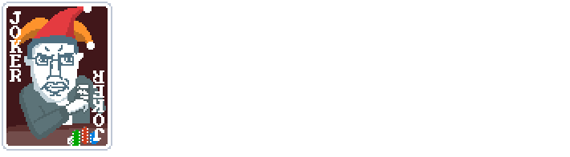

  

  Ever wanted nothing to happen more? Use the new Chudjoker and ensure that nothing will ever happen!

## Installation (requires Steammodded)

download ZIP from the big green "Code" button, unzip and place the version you want in your mods folder

## v1.0.1 ----

reworks probability by just setting probability to 0 on aqcuirement and setting probability to 1 on card removal

this change WILL break cards with uneven probabilities (i.e. 2 in 3, 5 in 6, etc), but works fine with vanilla cards

old version that works with modded will still be included as a seperate folder (name "Chudjoker (for Modded")

## v1.0 ----

adds a single joker: "Chudjoker"

Chudjoker causes all listed probabilities to never happen by making them negative

because nothing ever happens.

